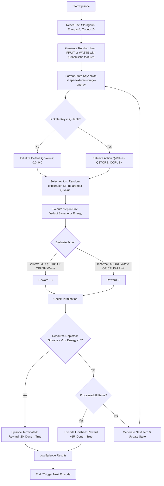

<div align="center">

# 🍎 Sortiq

### **A High-Fidelity Reinforcement Learning Visualizer & Simulation Platform**

[](https://fastapi.tiangolo.com)
[](https://nextjs.org)
[](https://react.dev)
[](https://en.wikipedia.org/wiki/Q-learning)
[](https://www.docker.com)

<p align="center">
  <strong>Sortiq</strong> is a production-grade visualizer and playground for Reinforcement Learning. It demonstrates a custom AI Agent trained using <strong>Q-Learning</strong> to distinguish between fresh agricultural produce and waste based on visual features (Color, Shape, and Texture). The agent operates within a constrained environment, managing finite storage capacity and crusher energy limits in real time.
</p>

</div>

---

## 🗺️ Table of Contents

1. [🎯 Key Features & Capabilities](#-key-features--capabilities)
2. [🧠 How It Works & Agent Workflow](#-how-it-works--agent-workflow)
3. [🏗️ Unified Monolith Architecture](#-unified-monolith-architecture)
4. [🔬 Core Code Deep Dive](#-core-code-deep-dive)
    - [State Space & State Serialization](#1-state-space--state-serialization)
    - [Q-Learning Engine & Mathematical Model](#2-q-learning-engine--mathematical-model)
    - [FastAPI Decision API Endpoints](#3-fastapi-decision-api-endpoints)
5. [⚙️ Environment Configuration](#%EF%B8%8F-environment-configuration)
6. [🛠️ Local Installation & Setup](#%EF%B8%8F-local-installation--setup)
    - [Backend Setup](#backend-setup)
    - [Frontend Setup](#frontend-setup)
7. [🐳 Docker & Unified Deployment](#-docker--unified-deployment)
8. [📊 Evaluation & Learning Performance](#-evaluation--learning-performance)
9. [🤝 Contributing & License](#-contributing--license)

---

## 🎯 Key Features & Capabilities

- **Retro-Futuristic Visual Interface**: A visual dashboard styled in a high-fidelity Matrix/Cyberpunk pixel-art aesthetic. Includes dynamic scanlines, canvas matrix falls, and custom CSS micro-animations.
- **Real-Time Inference HUD**: Displays cumulative episode scores, storage capacity, crusher energy levels, conveyor belt states, and running agent accuracy.
- **Dynamic Brain State Visualization**: Visualizes the agent's real-time Q-Value confidence scores for `STORE` vs. `CRUSH` actions, offering direct insight into the decision-making policy.
- **Interactive Simulation Controls**: Allows developers to adjust the simulation speed on the fly (up to 4x speed) or pause/resume execution.
- **In-App Theory & Blog**: A complete embedded blog detailing RL math, bellman updates, and architectural designs directly within the UI.

---

## 🧠 How It Works & Agent Workflow

The core challenge for the agent is to maximize its lifetime rewards by storing **FRUIT** and crushing **WASTE** while avoiding resource overflow. If storage or energy runs out, the episode fails. If the agent successfully processes all items, the episode succeeds.

The decision loop is detailed in the flowchart below:



---

## 🏗️ Unified Monolith Architecture

Sortiq is built using a **Unified Monolith Architecture** that simplifies local development, scaling, and Dockerized deployment:

- **Frontend**: A highly dynamic Single Page Application (SPA) built with **Next.js 16**, **React 19**, and styled with **Tailwind CSS v4** and Framer Motion. 
- **Backend & Simulation**: Powered by **FastAPI** (Python), serving the custom-built Gym-like environment and loading a pre-trained state Q-Table (~9,000 states) for instant inference.
- **Unified Engine**: During the Docker build, the Next.js frontend is compiled into a static export (`next build` / `out`) and copied into the backend's directory structure. The FastAPI server uses custom routing to serve these static assets on a single, unified port (`7860`), allowing a seamless, dependency-free runtime.

---

## 🔬 Core Code Deep Dive

### 1. State Space & State Serialization

To avoid excessive state-space fragmentation while maintaining robust feature representation, states are represented as string keys combining structural item features and resource metrics:

```python
def get_state_key(state_dict):
    # Serializes high-dimensional state to a lookup key
    # Example Output: "Red-Round-Hard-6-4"
    feat = state_dict["features"]
    return f"{feat['color']}-{feat['shape']}-{feat['texture']}-{state_dict['store_capacity']}-{state_dict['crusher_energy']}"
```

### 2. Q-Learning Engine & Mathematical Model

The agent learns how to sort optimal combinations through trial and error using a Q-Table mapping states to action values. We update these values using the classical **Bellman Optimality Equation**:

$$Q(s, a) \leftarrow Q(s, a) + \alpha \left[ R + \gamma \max_{a'} Q(s', a') - Q(s, a) \right]$$

Where:
- $\alpha$ (Learning Rate) = $0.1$
- $\gamma$ (Discount Factor) = $0.95$
- $\epsilon$ (Exploration Rate) starts at $1.0$ and decays by a factor of $0.99$ each episode.

Here is the update implementation from `Env/agent.py`:

```python
# Compute target based on state transition
if done:
    target = reward
else:
    target = reward + gamma * max(next_q_values)

# Bellman equation update
new_q = old_q + alpha * (target - old_q)

# Update state Q-Table
q_table[state_key][index] = new_q
```

### 3. FastAPI Decision API Endpoints

The backend (`server/api.py`) handles state-action queries. The endpoint receives client requests, performs greedy action selection based on the pre-trained Q-Table, steps the environment, and returns state transitions:

```python
@app.post("/agent-step")
async def agent_step():
    global cumulative_score, is_done
    if is_done:
        raise HTTPException(status_code=400, detail="Episode finished")

    state_str = str(env.state)
    # Greedy Q-value action selection
    if state_str in q_table:
        action_idx = int(np.argmax(q_table[state_str]))
    else:
        action_idx = np.random.randint(0, 2)
    
    action = "STORE" if action_idx == 0 else "CRUSH"
    q_vals = q_table.get(state_str, [0.0, 0.0])
    
    current_item = env.current_item.copy()
    next_state, reward, done = env.step(action)
    cumulative_score += reward
    is_done = done

    return {
        "item": current_item,
        "action": action,
        "q_values": {"STORE": float(q_vals[0]), "CRUSH": float(q_vals[1])},
        "reward": float(reward),
        "done": done,
        "score": float(cumulative_score),
        "storage": int(env.current_storage),
        "energy": int(env.current_energy),
        "is_correct": (action == "STORE" and current_item["type"] == "FRUIT") or (action == "CRUSH" and current_item["type"] == "WASTE")
    }
```

---

## ⚙️ Environment Configuration

You can customize the environment tasks and limits in `Env/agent.py` and `server/api.py`. The standard task consists of:

| Parameter | Default Value | Description |
|---|---|---|
| `itemsCount` | `10` | Number of items passing through the conveyor belt in a single episode. |
| `store_capacity` | `6` | Total allowable `STORE` actions before a resource depletion penalty occurs. |
| `crusher_energy` | `4` | Total allowable `CRUSH` actions before a resource depletion penalty occurs. |

---

## 🛠️ Local Installation & Setup

### Backend Setup

1. **Clone the Repository**:
   ```bash
   git clone https://github.com/Durgaprasad-Developer/Sortiq.git
   cd Sortiq
   ```

2. **Set up a Virtual Environment**:
   ```bash
   python -m venv venv
   source venv/bin/activate  # On Windows: venv\Scripts\activate
   ```

3. **Install Dependencies**:
   ```bash
   pip install -r requirements.txt
   pip install -r server/requirements.txt
   ```

4. **Train the RL Agent (Optional)**:
   This will train the agent over 15,000 episodes and output an updated `q_table.json` and a training convergence plot (`assets/training_curve.png`).
   ```bash
   python Env/agent.py
   ```

5. **Start the API Server**:
   ```bash
   python server/api.py
   ```
   The backend API will run on [http://localhost:7860](http://localhost:7860).

### Frontend Setup

1. **Navigate to the Client Directory**:
   ```bash
   cd client
   ```

2. **Install npm Packages**:
   ```bash
   npm install
   ```

3. **Launch Developer Server**:
   ```bash
   npm run dev
   ```
   The visualizer frontend will be available at [http://localhost:3000](http://localhost:3000).

---

## 🐳 Docker & Unified Deployment

Sortiq leverages a multi-stage Dockerfile that builds the React application and mounts it to a Python environment, allowing it to run as a single container.

1. **Build the Unified Docker Image**:
   ```bash
   docker build -t sortiq .
   ```

2. **Run the Container**:
   ```bash
   docker run -p 7860:7860 sortiq
   ```
   Open your browser to [http://localhost:7860](http://localhost:7860) to see both the API and the visualization served natively from the single container.

---

## 📊 Evaluation & Learning Performance

The pre-trained Q-Learning agent shows exceptionally robust convergence behavior. Rather than sorting randomly, it acquires high accuracy by correctly identifying the reward mapping and reserving resources for the correct produce.

### 📈 Training Convergence Curve
The agent reaches convergence after approximately 6,000 episodes, maintaining an average cumulative score near the maximum reward bounds.


### 📈 Trained Agent vs. Random Baseline
Evaluating both agents over 300 test episodes shows a stark performance improvement. While the random agent suffers severe penalties due to early storage and energy exhaustion, the pre-trained Q-table agent achieves near-perfect resource management.


---

## 🤝 Contributing & License

Contributions are always welcome! Feel free to open issues or submit pull requests to enhance the environment capabilities, add deeper agent visualizations, or support other deep-RL algorithms (such as DQN or PPO).

This project is licensed under the MIT License.

---
<div align="center">
  Created with ❤️ for Advanced AI & Reinforcement Learning Education.
</div>
